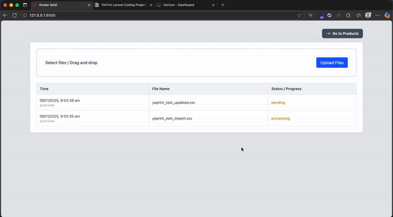

# Installation & Setup Guide

This guide explains how to install and run the Laravel + Vue + Reverb + Horizon project from scratch.

---

## 1. Requirements

Before you begin, make sure you have installed:

- **PHP ≥ 8.3** (via Homebrew or manual install)
- **Composer**
- **Node.js & npm**
- **Redis** (for queue and real-time)
- **SQLite/MySQL/PostgreSQL** (your choice)

---

## 2. Installation

Clone the project and install dependencies:

```bash
git clone https://github.com/rootchips/upload-files.git
cd upload-files
composer install
npm install
```

---

## 3. Configuration

Copy the `.env` file and generate the app key:

```bash
cp .env.example .env
php artisan key:generate
```

Then edit `.env` and ensure you include:

```env
BROADCAST_CONNECTION=reverb
QUEUE_CONNECTION=redis

REVERB_APP_ID=666
REVERB_APP_KEY=RANDOMSTRING
REVERB_APP_SECRET=RANDOMSTRING
REVERB_HOST="0.0.0.0"
REVERB_PORT=8080
REVERB_SCHEME=http

VITE_REVERB_APP_KEY=${REVERB_APP_KEY}
VITE_REVERB_HOST=${REVERB_HOST}
VITE_REVERB_PORT=${REVERB_PORT}
```

---

## 4. Setup Services

Install and configure **Reverb** and **Horizon**:

```bash
php artisan reverb:install
php artisan horizon:install
```

Run migrations:

```bash
php artisan migrate
```

---

## 5. Run the Application

Now you can start all services in separate terminals:

```bash
php artisan horizon
php artisan reverb:start
npm run dev
php artisan serve
```

---

## 6. Page Example

Here’s how it looks when everything is running:





---

## 7. Troubleshooting

If you face errors:

| Issue | Cause | Fix |
|-------|--------|-----|
| `POST Content-Length exceeds limit` | `php.ini` too small | Increase `post_max_size` and `upload_max_filesize` |
| `FileIsTooBig` | MediaLibrary limit | Add `->setMaxFileSize()` in `config/media-library.php` |
| `Class "League\Csv\Reader" not found` | Missing package | Run `composer require league/csv` |

---
